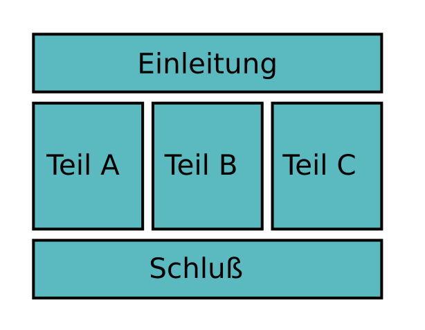

# Redestruktur

## Ziel

Halte eine Rede, die klar in Einleitung, Hauptteil und Schluß gegliedert ist.

## Hintergrund

Warum ist die Struktur einer Rede wichtig? Zum einen ist die Struktur ist einer der ganz großen Verständlichmacher für das Publikum. Zum anderen hilft sie Dir beim Reden genau zu wissen, an welcher Stelle Du Dich befindest. Schließlich dient die Struktur als Rettungsanker: selbst wenn ganz viel schief geht und Du z.B. nur halb so viel Zeit hast oder der Beamer bei der Präsentation ausfällt, hilft Dir eine solide Struktur dabei, deine wichtigsten Aussagen trotzdem zu vermitteln.

### Die Einleitung

Der Anfang einer Rede soll vor allem eines: *Appetit auf den Rest machen*. Erzähle eine kurze Anekdote oder erkläre wie Du zum Thema gekommen bist. Kündige an, worum es in der Rede geht, ohne zu viel zu verraten.

### Der Hauptteil

Der Hauptteil einer Rede sollte aus 2-4 Punkten aufgebaut sein. Bei mehr verliert der Zuhörer in der kurzen Zeit schnell den Überblick. Für das Verständnis ist es wichtig, dass die Übergänge zwischen den Teilen klar erkennbar sind. Wenn Du auf Nummer sicher gehen möchtest, kannst Du die einzelnen Teile auch ankündigen: *"Mein erster Punkt ist .."*

Es gibt sehr viele Möglichkeiten, den Hauptteil einer Rede zu strukturieren. Für dieses Projekt kannst Du eine der folgenden Möglichkeiten wählen:

* **Aufzählung**: Erster Punkt, Zweiter Punkt, Dritter Punkt
* **Zeitliche Folge**: Vergangenheit, Gegenwart, Zukunft
* **Vergleich**: Vorschlag, Alternative, Schlußfolgerung warum die Alternative besser ist.
* **Dramatische Struktur**: Problem, Auseinandersetzung, Höhepunkt

### Der Schluß

Der Schluß einer Rede sollte noch einmal die Kernaussage betonen. Auch hier hast Du wieder mehrere Möglichkeiten zur Auswahl: Eine Zusammenfassung des bisher gesagten ist sicherlich die einfachste Variante. Etwas schwieriger ist ein Appell (eine Handlungsanforderung) an das Publikum. Ein gut plaziertes Zitat oder ein eigener prägnanter Satz eignen sich besonders für das Ende. So machst Du dem Publikum unmißverständlich deutlich, dass Deine Rede vorbei ist (und applaudiert werden darf).

Der Fokus dieses Redeprojektes liegt dabei, Dir im Voraus eine Struktur für Dein Thema zu überlegen und die Rede dementsprechend vorzubereiten.

## Zeit

5-7 Minuten

## Fragen für Redebewerter/innen

* Was hat Dir an der Rede gut gefallen?
* Wie war die Einleitung der Rede aufgebaut?
* Wie wurden die Übergänge zwischen den einzelnen Abschnitte gestaltet?
* Woraus bestand der Schlußteil der Rede?
* War die zeitliche Aufteilung der Teile der Rede aus Deiner Sicht gelungen?
